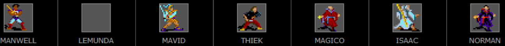
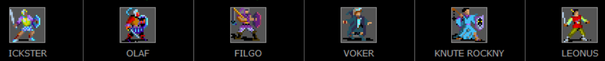

# Land of Lafton - an Unlimited Adventures design

Download this GitHub repo using [this link](https://github.com/RedDragonWebDesign/LandOfLafton/archive/refs/heads/master.zip). Then navigate to src/LANDOFLA.DSN and copy that into your Unlimited Adventures folder.

## Introduction - Son

When I was around 7 years old, my dad spent a month or two with the office door closed for an hour or two a day working on something mysterious. During Christmas that year, I found out what it was. He had spent many many hours programming in his Dungeons & Dragons content that he had played during the 80s into the hottest new D&D software at the time: Unlimited Adventures. And he gave it to me for Christmas. I spent many hours playing this design. This ended up becoming a formative and important part of my childhood. I have many fond memories of this.

RedDragonWebDesign

2025

## Introduction - Father

Land of Lafton

Lafton is a small keep located in the middle of a troubled continent. Civilization is being stressed by the forces of evil. Key mountian passes are blocked by monsters, or worse yet, greedy and powerful humans. Beneath it all lies a powerful source of evil.

This Unlimited Adventures design is the electronic version of my world. My original world was started back in 1978 and I've been adding to it slowly ever since. I and others played in this world off and on from 1978 through 1994. Beginning this year, I transformed portions of it into Unlimited Adventures. My seven year old son and I have been playing and testing it ever since.

You can start out at 4th level and work yourself up. Explore Lafton, and then start traveling arround. If an area seems too hard, reduce the difficulty to Novice. If that still doesn't work, give up on that area and go elsewhere to get more experience, then come back later when you are stronger.

I hope you have fun.

Meonus ...

1995

## Installation instructions

* Go buy Unlimited Adventures on Steam for USD $3.99 - https://store.steampowered.com/app/1882280/Forgotten_Realms_The_Archives__Collection_Two/
* Install Steam app on PC. Launch it. Log in.
* Go to the Library tab, and download Forgotten Realms: The Archives - Collection Two
* When that's done, right click on Forgotten Realms: The Archives - Collection Two -> Manage -> Browse local files. This will open a folder where you need to copy some files to. On my computer, the path is C:\Program Files (x86)\Steam\steamapps\common\Forgotten Realms The Archives - Collection Two
* Double click on "games", then on "Unlimited Adventures -ENG", then on DESIGNS, then on UA. The file path should now be something like C:\Program Files (x86)\Steam\steamapps\common\Forgotten Realms The Archives - Collection Two\games\Unlimited Adventures -ENG\DESIGNS\UA
* [Download the files in this GitHub repo](https://github.com/RedDragonWebDesign/LandOfLafton/archive/refs/heads/master.zip) to somewhere on your computer. For example, mine is at F:\other-peoples-githubs\LandOfLafton.
* Copy the LANDOFLA.DSN folder from this repo to the \steamapps\ folder mentioned above. So for example, copy F:\other-peoples-githubs\LandOfLafton\src\LANDOFLA.DSN to C:\Program Files (x86)\Steam\steamapps\common\Forgotten Realms The Archives - Collection Two\games\Unlimited Adventures -ENG\DESIGNS\UA
* Go back into Steam and click Play
* In the left menu, click on Unlimited Adventures, then click Play
* When it asks the copy protection question, type a random letter then press enter. (You can't leave it blank.)
* Select a design -> Land of Lafton Update 4/20/97 -> Select

## Map of overland

Coordinates such as (5,4) are the menu town's location in Dungeon 03 Transfer. Codes starting with D such as D04 stand for "Dungeon" and correspond to the module number.

## List of towns

* Cities
	* Athens - temple has level 5 spells (raise dead)
	* Gobville - temple has level 7 spells (raise dead)
	* Gorgobina - temple has level 5 spells (raise dead)
	* Krell's Gate - temple has level 7 spells (raise dead). temple is in the inner keep
	* Lafton Keep - temple has level 5 spells (raise dead)
	* Wildershin - temple has level 5 spells (raise dead)
* Towns
	* Colga - temple has level 4 spells
	* Dion - temple has level 4 spells
	* Fraido - temple has level 1 spells
	* Fror's Place - temple has level 3 spells
	* Layover - temple has level 1 spells
	* Portown - temple has level 3 spells

## List of dungeons

Should probably visit dungeons in the order they were created, since that should be roughly ascending order of difficulty. Except maybe Drow1/Drow2, which are really hard.

For more details, see [DUNGEONS.md](DUNGEONS.md)

* Overland 01
* Overland 02
* Overland 03
* Overland 04
* Dungeon 01 - Lafton 1 - Outer Keep
* Dungeon 02 - Lafton 2 - Inner Keep
* Dungeon 03 - Transfer
* Dungeon 04 - Goblin 1
* Dungeon 05 - Hobgoblin Pass & Giant Pass
* Dungeon 06 - Drow 1
* Dungeon 07 - Drow 2
* Dungeon 08 - Fror's Place (Lower Level)
* Dungeon 09 - Wasteland / Dragon Mountain
* Dungeon 10 - Bugbears
* Dungeon 11 - Lizard Man Island (Island W)
* Dungeon 12 - Danger Forest
* Dungeon 13 - Eldman's Fortress
* Dungeon 14 - Lafton 3 - Under Attack
* Dungeon 15 - Ships
* Dungeon 16 - Quest for the Golden Fleece
* Dungeon 17 - Snake Worshippers
* Dungeon 18 - Eldamar
* Dungeon 19 - Manta Claus
* Dungeon 20 - Colga Wharf
* Dungeon 21 - Krell's Gate
* Dungeon 22 - Porttown Dungeon
* Dungeon 23 - Random Dungeon 1
* Dungeon 24 - Random Dungeon 2
* Dungeon 25 - Random Dungeon 3
* Dungeon 26 - Drow 3
* Dungeon 27 - Dolmen Moor
* Dungeon 28 - Llywelyn's Tomb
* Dungeon 29
* Dungeon 30
* Dungeon 31
* Dungeon 32
* Dungeon 33
* Dungeon 34
* Dungeon 35

## List of quests

1. Lafton 1 - fight thieves
2. Goblin Caves - 
3. Hobgoblin Pass / Giant Pass - 
4. Drow 1 & Drow 2 - 
5. Lafton - revenge party? Or Fror's Place?
6. Bugbear Caves - 
7. Bugbear Caves - on alert
8. Eldman's Fortress - 
9. Lafton 3 - under attack. triggered by finishing quest 11
10. Quest for the Golden Fleece - 
11. Snake Worship - 
12. Eldamar - 
13. Manta Claus - 
14. Colga Wharf - once the attack begins, no inn and no resting
15. Colga Wharf - 
16. Krell's Gate - 
17. Porttown Dungeon - 
18. Random Dungeon 1 - top half. once you clear that half out, random encounters go away
19. Random Dungeon 1 - bottom half. once you clear that half out, random encounters go away
20. Random Dungeon 2 - top half. once you clear that half out, random encounters go away
21. Random Dungeon 2 - bottom half. once you clear that half out, random encounters go away
22. Random Dungeon 3 - top half. once you clear that half out, random encounters go away
23. Random Dungeon 3 - bottom half. once you clear that half out, random encounters go away
24. Drow 3 - 
25. 
26. 
27. 
28. 
29. 
30. 
31. 
32. 
33. 
34. 
35. 
36. 
37. 
38. 
39. 
40. 
41. 
42. 
43. 
44. 

## List of keys

1. Apartment Key - Lafton 1 - Get this by joining the thieves guild in Lafton for 100PP. Grants you access to an apartment in Lafton where you can rest.
2. Drow Key - Drow 1 - found in north closet of first room. opens a door in the middle of the dungeon, and at the end of the dungeon. mandatory to get to drow 2 from drow 1.
3. Ring of Ram - Quest for the Golden Fleece
4. Chime of Opening - Quest for the Golden Fleece
5. Copper Key - Eldamar
6. Bronze Key
7. Steel Key
8. Large Drow Key - Drow 3

## List of items

1. Hobgoblin Pass - Hobgoblin Pass
2. Helm of Kings - Bugbear Caves
3. Amulet of Drow - Drow 2
4. Lizard Man Skull - Lizard Man Island
5. Dust of Dalenil
6. Llywelyn's Body - Llywelyn's Tomb
7. Metal Rod - Llywelyn's Tomb - causes the iron golems guarding Llywelyn's Tomb to ignore you
8. Item 8
9. Item 9
10. Item 10
11. Item 11
12. Item 12

## List of NPCs

* Apolla
* Cheryl Teak - Lafton under attack - picked up in Gorgobina
* Athlon - Lafton under attack - picked up in Gorgobina
* [TODO: more]

## Starting settings

* 8000 XP per character (4th level)
* modest starting equipment per character
* 50 platinum pieces per character

## Suggested early goals

* Join the thieves guild for 100PP. This will get you a key to an apartment so you don't need to pay the innkeeper, and will get you the correct password to the inner keep.

## List of saved games

### ReddRagonWebDesign's characters

* A - RedDragonWebDesign's characters, low level
	* Manwell - level 5 fighter (melee)
	* Twu - level 5 fighter (archer)
	* Mavid - level 3 paladin
	* Lot - level 3 magic user
	* Isaac - level 4 cleric
	* Thiek - level 6 thief
	* Lemunda - NPC, level 6 fighter
* B, C, D, E - RedDragonWebDesign's characters, high level. the highest level ones are in save B. must have been the last save I did.
	* Silk - NPC, level 12/19 fighter/thief
	* Manwell - level 11 fighter (melee)
	* Lemunda - NPC, level 9 fighter
	* Mavid - level 9 paladin
	* Thiek - level 13 thief
	* Magico - level 11 magic user
	* Isaac - level 10 cleric
	* Norman - level 10 magic user

### Meonus's characters

* F, G - Meonus's characters
	* Olaf - level 11 fighter
	* Lemunda - NPC, level 9 fighter
	* Athlon - level 9 ranger
	* Filgo - level 10 cleric
	* Leonus - NPC? level 5/10/11 fighter/magic-user/thief
	* Knute Rockny - level 7 cleric
	* Jenelle - level 7 cleric
* H, I - Meonus's characters. Knute Rockny is higher level than in F & G, so this must be where Meonus left off
	* Lemunda - NPC, level 9 fighter
	* Olaf - level 11 fighter
	* Filgo - level 10 cleric
	* Knute Rockny - level 9 cleric
	* Leonus - NPC? level 5/10/11 fighter/magic-user/thief
	* Voker - level 9 magic-user
	* Athlon - level 9 ranger
* J - Meonus's characters. Voker is lower level than in H, I
	* Lemunda - NPC, level 9 fighter
	* Ickster - level 9 fighter
	* Olaf - level 11 fighter
	* Filgo - level 10 cleric
	* Voker - level 8 magic-user
	* Knute Rockny - level 9 cleric
	* Leonus - NPC? level 5/10/11 fighter/magic-user/thief

## Custom artwork

None that I recall. I think it's all vanilla Unlimited Adventures artwork.

## Custom monster stats

Not much modification to monster stats. Looks like around 20 have been modified. If you go into the monster editor, I see a couple out of alphabetical order (a bug?), a couple with * next to them (modified?), and a couple with (#) next to them (NPCs that were renamed?)

## Password

The password to edit the design is 3410

Fun fact: Unlimited Adventures stores its design passwords in cleartext, towards the end of the file GAME001.DAT. I discovered this as a kid and broken into Land of Lafton even though my dad was trying to keep me out of the dungeon editor. Lol.

## Bugs and corruption

This design may be slightly damaged. The following things have happened to it:

* The dungeon editor has an "off by 1" error for dungeons 25 and above. The dungeon display name doesn't match the actual dungeon name.
* Dungeon 22 is currently blank. Perhaps this used to be a dungeon and got messed up.

I recall a hard drive failure deleting some un-backed-up designs I had created, and it also probably destroyed a couple dungeons in Land of Lafton. I think we had to revert to an old backup that was missing some dungeons.

If you know how to fix any of these bugs, please feel free to make a ticket or a pull request!

## Things to fix

* I have a note that Hobgoblin Pass is buggy.
* There's a nasty battle in Drow 1 that is duplicated once at each door. Should merge those together so that PCs don't trigger it twice by mistake.

## Dungeons to add

* Dungeon 15 Ships was never finished.
* Dungeon 20 Colga Wharf was never finished. It may have been lost in a hard drive failure.
* Dungeon 22 Porttown Dungeon is blank. It may have been lost in a hard drive failure. It is basically the dungeon from TSR 2001.
* We played TSR 9023 In Search Of The Unknown on tabletop D&D but it never got programmed into this. This is the dungeon called Quasqueton and it has an upper level and a lower level. I believe it was by the city of Dion. Definitely somewhere in the east.

## The Secret Shop

If you have PCs from other adventures and you want to import them into this design at high level, one way to do it is to create the characters at low level, then visit the secret shop. The secret shop is visited via Gorgobina. After the menu town, it will ask you where to go. Select "Stay in Gorgobina". Then it will ask you "Do you look for the secret shop?" Click "yes" and give the password "Tower". This will take you to a special shop with 7 rooms where you can buy magical items for free and gain experience points for free to equip your characters. The secret shop is technically located in Dungeon 03 Goblin Caves. I do not recommend visiting the secret shop for anything except for equipping imported characters one time, as this is basically a powerful cheat that will make the game less fun.

## Reminder about how dying works

If you die, you need the level 5 cleric spell "raise dead", which you can pay for at certain temples, and typically costs around 1200 PP. Each time a character is raised, they lose a constitution point. Raise dead only works on non-elves. Raise dead doesn't work every time, there is a roll involved that is harder if constitution is low or the character has been dead a long time. Moral of the story: save often, and don't be afraid to go back to old saves. The level 7 cleric spell "resurrection" is the same thing except you start with full hit points instead of one hit point.

## How to change the difficulty level

Encamp -> Alt -> Level -> pick from Novice, Squire, Veteran, Adept, Champion

According to the manual, Veteran is the most balanced. Adept and Champion make combat harder, but you get more XP. Novice and Squire make combat easier, but you get less XP.

It's probably best to keep things on Veteran.
