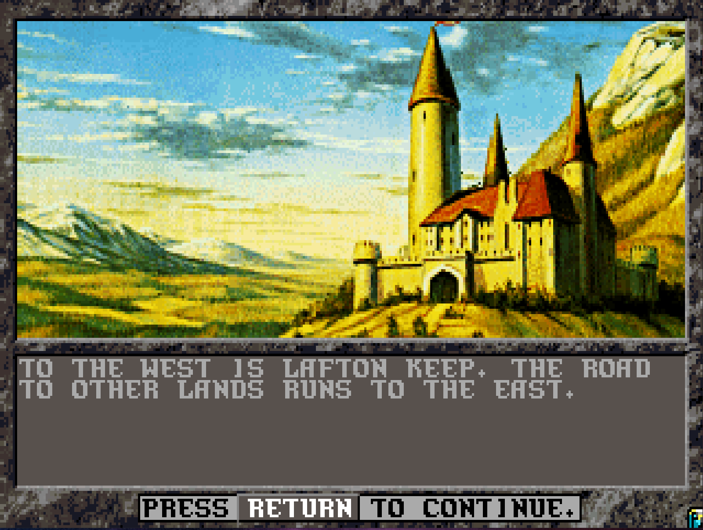

# Land of Lafton - an Unlimited Adventures design

Download this GitHub repo using [this link](https://github.com/RedDragonWebDesign/LandOfLafton/archive/refs/heads/master.zip). Then navigate to src/LANDOFLA.DSN and copy that into your Unlimited Adventures folder.

## Introduction - Son

When I was around 7 years old, my dad spent a month or two with the office door closed for an hour or two a day working on something mysterious. During Christmas that year, I found out what it was. He had spent many many hours programming in his Dungeons & Dragons content that he had played during the 80s into the hottest new D&D software at the time: Unlimited Adventures. And he gave it to me for Christmas. I spent many hours playing this design. This ended up becoming a formative and important part of my childhood. I have many fond memories of this.

RedDragonWebDesign

2025

## Introduction - Father

Land of Lafton

Lafton is a small keep located in the middle of a troubled continent. Civilization is being stressed by the forces of evil. Key mountian passes are blocked by monsters, or worse yet, greedy and powerful humans. Beneath it all lies a powerful source of evil.

This Unlimited Adventures design is the electronic version of my world. My original world was started back in 1978 and I've been adding to it slowly ever since. I and others played in this world off and on from 1978 through 1994. Beginning this year, I transformed portions of it into Unlimited Adventures. My seven year old son and I have been playing and testing it ever since.

You can start out at 4th level and work yourself up. Explore Lafton, and then start traveling arround. If an area seems too hard, reduce the difficulty to Novice. If that still doesn't work, give up on that area and go elsewhere to get more experience, then come back later when you are stronger.

I hope you have fun.

Meonus ...

1995

## Installation instructions

* Go buy Unlimited Adventures on Steam for USD $3.99 - https://store.steampowered.com/app/1882280/Forgotten_Realms_The_Archives__Collection_Two/
* Install Steam app on PC. Launch it. Log in.
* Go to the Library tab, and download Forgotten Realms: The Archives - Collection Two
* When that's done, right click on Forgotten Realms: The Archives - Collection Two -> Manage -> Browse local files. This will open a folder where you need to copy some files to. On my computer, the path is C:\Program Files (x86)\Steam\steamapps\common\Forgotten Realms The Archives - Collection Two
* Double click on "games", then on "Unlimited Adventures -ENG", then on DESIGNS, then on UA. The file path should now be something like C:\Program Files (x86)\Steam\steamapps\common\Forgotten Realms The Archives - Collection Two\games\Unlimited Adventures -ENG\DESIGNS\UA
* [Download the files in this GitHub repo](https://github.com/RedDragonWebDesign/LandOfLafton/archive/refs/heads/master.zip) to somewhere on your computer. For example, mine is at F:\other-peoples-githubs\LandOfLafton.
* Copy the LANDOFLA.DSN folder from this repo to the \steamapps\ folder mentioned above. So for example, copy F:\other-peoples-githubs\LandOfLafton\src\LANDOFLA.DSN to C:\Program Files (x86)\Steam\steamapps\common\Forgotten Realms The Archives - Collection Two\games\Unlimited Adventures -ENG\DESIGNS\UA
* Go back into Steam and click Play
* In the left menu, click on Unlimited Adventures, then click Play
* When it asks the copy protection question, type a random letter then press enter. (You can't leave it blank.)
* Select a design -> Land of Lafton Update 4/20/97 -> Select

## Map of overland

Coordinates such as (5,4) are the menu town's location in Dungeon 03 Transfer. Codes starting with D such as D04 stand for "Dungeon" and correspond to the module number.

## List of towns

* Cities
	* Athens - temple has level 5 spells (neutralize poison, raise dead)
	* Gobville - temple has level 7 spells (neutralize poison, raise dead, restoration)
	* Gorgobina - temple has level 5 spells (neutralize poison, raise dead)
	* Krell's Gate - temple has level 7 spells (neutralize poison, raise dead, restoration). temple is in the inner keep
	* Lafton Keep - temple has level 5 spells (neutralize poison, raise dead)
	* Wildershin - temple has level 5 spells (neutralize poison, raise dead)
* Towns
	* Colga - temple has level 4 spells (neutralize poison)
	* Dion - temple has level 4 spells (neutralize poison)
	* Fraido - temple has level 1 spells
	* Fror's Place - temple has level 3 spells
	* Layover - temple has level 1 spells
	* Portown - temple has level 3 spells

## List of dungeons

Should probably visit dungeons in the order they were created, since that should be roughly ascending order of difficulty. Except maybe Drow1/Drow2, which are really hard.

For more details, see [DUNGEONS.md](DUNGEONS.md)

* Overland 01
* Overland 02
* Overland 03
* Overland 04
* Dungeon 01 - Lafton 1 - Outer Keep
* Dungeon 02 - Lafton 2 - Inner Keep
* Dungeon 03 - Transfer
* Dungeon 04 - Goblin 1
* Dungeon 05 - Hobgoblin Pass & Giant Pass
* Dungeon 06 - Drow 1
* Dungeon 07 - Drow 2
* Dungeon 08 - Fror's Place (Lower Level)
* Dungeon 09 - Wasteland / Dragon Mountain
* Dungeon 10 - Bugbears
* Dungeon 11 - Lizard Man Island (Island W)
* Dungeon 12 - Danger Forest
* Dungeon 13 - Eldman's Fortress
* Dungeon 14 - Lafton 3 - Under Attack
* Dungeon 15 - Ships
* Dungeon 16 - Quest for the Golden Fleece
* Dungeon 17 - Snake Worshippers
* Dungeon 18 - Eldamar
* Dungeon 19 - Manta Claus
* Dungeon 20 - Colga Wharf
* Dungeon 21 - Krell's Gate
* Dungeon 22 - Porttown Dungeon
* Dungeon 23 - Random Dungeon 1
* Dungeon 24 - Random Dungeon 2
* Dungeon 25 - Random Dungeon 3
* Dungeon 26 - Drow 3
* Dungeon 27 - Dolmen Moor
* Dungeon 28 - Llywelyn's Tomb
* Dungeon 29
* Dungeon 30
* Dungeon 31
* Dungeon 32
* Dungeon 33
* Dungeon 34
* Dungeon 35

## List of quests

1. Lafton 1 - fight thieves. part 1 is before you have the thieves guild battle. part 2 is before you have the outside of town battle.
2. Goblin Caves - 
3. Hobgoblin Pass / Giant Pass - 
4. Drow 1 & Drow 2 - 
5. Lafton 2 - you get this quest if you attack Olaf in the room on level 6 of the keep. 5 steps after doing so, you will be attacked by more guards one time.
6. Bugbear Caves - 
7. Bugbear Caves - on alert
8. Eldman's Fortress - 
9. Lafton 3 - under attack. triggered by finishing quest 11
10. Quest for the Golden Fleece - 
11. Snake Worship - 
12. Eldamar - 
13. Manta Claus - 
14. Colga Wharf - once the attack begins, no inn and no resting
15. Colga Wharf - 
16. Krell's Gate - 
17. Porttown Dungeon - 
18. Random Dungeon 1 - top half. once you clear that half out, random encounters go away
19. Random Dungeon 1 - bottom half. once you clear that half out, random encounters go away
20. Random Dungeon 2 - top half. once you clear that half out, random encounters go away
21. Random Dungeon 2 - bottom half. once you clear that half out, random encounters go away
22. Random Dungeon 3 - top half. once you clear that half out, random encounters go away
23. Random Dungeon 3 - bottom half. once you clear that half out, random encounters go away
24. Drow 3 - 
25. 
26. 
27. 
28. 
29. 
30. 
31. 
32. 
33. 
34. 
35. 
36. 
37. 
38. 
39. 
40. 
41. 
42. 
43. 
44. 

## List of keys

1. Apartment Key - Lafton 1 - Get this by joining the thieves guild in Lafton for 100PP. Grants you access to an apartment in Lafton where you can rest.
2. Drow Key - Drow 1 found in north closet of first room. opens a door in the middle of the dungeon, and at the end of the dungeon. mandatory to get to drow 2 from drow 1.
3. Ring of Ram - Quest for the Golden Fleece
4. Chime of Opening - Quest for the Golden Fleece
5. Copper Key - Eldamar
6. Bronze Key - Lafton 2 - find this in Olaf's conference room, but you have to kill Olaf to get it. it opens a treasure room downstairs.
7. Steel Key
8. Large Drow Key - Drow 3

## List of items

1. Hobgoblin Pass - Hobgoblin Pass
2. Helm of Kings - Bugbear Caves
3. Amulet of Drow - Drow 2
4. Lizard Man Skull - Lizard Man Island
5. Dust of Dalenil
6. Llywelyn's Body - Llywelyn's Tomb
7. Metal Rod - Llywelyn's Tomb - causes the iron golems guarding Llywelyn's Tomb to ignore you
8. Item 8
9. Item 9
10. Item 10
11. Item 11
12. Item 12

## List of NPCs

NPCs don't get any money when you press share. But you also can't trade anything out of their inventory or sell from their inventory.

* Lemunda - Lafton 1. pick her up in the tavern. level 6 fighter
* Cheryl Teak
	* Lafton 2 - in a room upstairs. there's also a spot where she is removed downstairs, so avoid that spot if you want to keep her
	* Lafton 3 - picked up in Gorgobina
* Athlon
	* Drow 1 - ranger. can rescue him. he's a prisoner in the first room. he gives you the Drow Key
	* Lafton 3 - picked up in Gorgobina
* Apolla
* [TODO: more]

## Starting settings

* 8000 XP per character (4th level)
* modest starting equipment per character
* 50 platinum pieces per character

## Saved games and characters

For more details about the saved games and characters that come with this design, see [SAVED_GAMES.md](SAVED_GAMES.md).

## Custom artwork

None that I recall. I think it's all vanilla Unlimited Adventures artwork.

## Custom monster stats

Not much modification to monster stats. Looks like around 20 have been modified. If you go into the monster editor, I see a couple out of alphabetical order (a bug?), a couple with * next to them (modified?), and a couple with (#) next to them (NPCs that were renamed?)

## Password

The password to edit the design is 3410

Fun fact: Unlimited Adventures stores its design passwords in cleartext, towards the end of the file GAME001.DAT. I discovered this as a kid and broken into Land of Lafton even though my dad was trying to keep me out of the dungeon editor. Lol.

## Corruption

This design may be slightly damaged. If you know how to fix any of these bugs, please feel free to make a ticket or a pull request! The following things have happened to it:

* The dungeon editor has an "off by 1" error for dungeons 25 and above. The dungeon display name doesn't match the actual dungeon name.

## Events to fix

* Lafton 2 - remove fake door in the dungeon
* I have a note that Hobgoblin Pass is buggy.
* There's a nasty battle in Drow 1 that is duplicated once at each door. Should merge those together so that PCs don't trigger it twice by mistake.

## Dungeons to add

* Dungeon 15 Ships was never finished.
* Dungeon 20 Colga Wharf was never finished. It may have been lost in a hard drive failure.
* Dungeon 22 Porttown Dungeon is blank. It may have been lost in a hard drive failure. It is basically the dungeon from TSR 2001.
* We played TSR 9023 In Search Of The Unknown on tabletop D&D but it never got programmed into this. This is the dungeon called Quasqueton and it has an upper level and a lower level. I believe it was by the city of Dion. Definitely somewhere in the east.

## The Secret Shop

If you have PCs from other adventures and you want to import them into this design at high level, one way to do it is to create the characters at low level, then visit the secret shop. The secret shop is visited via Gorgobina. After the menu town, it will ask you where to go. Select "Stay in Gorgobina". Then it will ask you "Do you look for the secret shop?" Click "yes" and give the password "Tower". This will take you to a special shop with 7 rooms where you can buy magical items for free and gain experience points for free to equip your characters. The secret shop is technically located in Dungeon 03 Goblin Caves. I do not recommend visiting the secret shop for anything except for equipping imported characters one time, as this is basically a powerful cheat that will make the game less fun.

## Things to do on day 1

* go to the inn, memorize spells, and rest
* change game speed to 0 (fastest)
* change game difficulty to Veteran (in the middle, no XP penalties or bonuses, no modifications to monster difficulty)
* your characters come equipped with melee weapons and armor. but you'll want to buy some other stuff:
	* buy composite long bow and arrows for your fighter, paladin, ranger
	* buy composite short bow for your thief
	* buy a staff sling for your clerice
	* bows and arrows for everyone but your magic users
	* quarterstaffs and extra darts for your magic users
* Join the Guild of Heroes for 100PP. This will get you a key to an apartment so you don't need to pay the innkeeper, and will get you the correct password to the inner keep.
* Visit the tavern to pick up an NPC (Lemunda) and to get a quest to kill some thieves.

## Tips

* use "Q" to put any character on autopilot. best avoided with magic users since you want to micromanage what spells they cast. press "spacebar" during any character's turn to turn off all the quick modes you turned on.
* any character that goes unconscious, stand next to them with another character and press "B" to bandage them. this will save you an expensive trip to the temple to "raise dead" (which also permanently subtracts a point of constitution).
* have someone keep "detect magic" memorized all the time. then cast it on loot screens to see which items are magical. your first magical items in Lafton 1 will be in the first thieves' battle. if you have multiple combats in a row, the detect magic will last awhile.
* Lafton has the cheapest training. About 500 PP.
* Give magic bracers to your magic users. They don't improve your armor class, they just set your armor class. So your other characters that can wear armor will already have AC better than your bracers.
* If your characters die, go back to a saved game. Otherwise you have to go find a temple with at least level 5 spells to do raise dead, which is expensive, and which permanently drains a constitution point.
* If your characters get drained a level by undead, go back to a saved game. Otherwise you have to go find a temple with at least level 7 spells to do restoration, which is expensive.
* Unconscious characters miss out on experience points. Cast "cure light wounds" on them before the battle ends to get them back up.
* Spiders and some other creatures that poison you don't instantly kill you even though it looks like it. You can cast the 4th level cleric spell "neutralize poison" (or visit a temple and have them cast it), and the poisoned person will get right up and have 1 HP.
* You should keep "search" on all the time, unless it is causing lots of random encounters. Search lets you find most secret doors and some events that are "search only".
* Versus creatures with really nasty magical abilities, such as dragons and beholders, have them opportunity attack you to get them to waste their ability for that turn.
